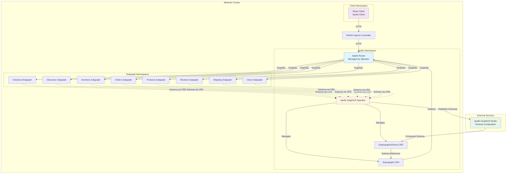

# Apollo Federation Supergraph Architecture

This repository contains a reference architecture utilizing [Kubernetes](https://kubernetes.io/docs/concepts/overview/) when using [Apollo Federation](https://www.apollographql.com/docs/federation/). It is designed to run locally on [Minikube](https://minikube.sigs.k8s.io/) for development and testing purposes.

Once the architecture is fully stood up, you'll have: 

- An Apollo Router running and managed by the [Apollo GraphOS Operator](https://www.apollographql.com/docs/apollo-operator/), utilizing:
  - [A coprocessor for handling customizations outside of the router](https://www.apollographql.com/docs/router/customizations/coprocessor)
  - [Authorization/Authentication directives](https://www.apollographql.com/docs/router/configuration/authorization)
- Eight subgraphs, each handling a portion of the overall supergraph schema, with schemas automatically published to GraphOS via the operator using inline SDL
- A React-based frontend application utilizing Apollo Client (optional)
- Apollo GraphOS Operator for automated schema publishing, composition, and deployment
- Step-by-step scripts for easy local setup and deployment

### The ending architecture

### Prerequisites

At a minimum, you will need:

- [Minikube](https://minikube.sigs.k8s.io/docs/start/) installed and configured
- [kubectl](https://kubernetes.io/docs/tasks/tools/) installed
- [Helm](https://helm.sh/docs/intro/install/) installed
- [Docker](https://docs.docker.com/get-docker/) installed
- [jq](https://stedolan.github.io/jq/download/) installed
- [curl](https://curl.se/) installed
- An [Apollo GraphOS account](https://studio.apollographql.com/signup) with a Personal API key
  - You can use [a free enterprise trial account](https://studio.apollographql.com/signup?type=enterprise-trial) if you don't have an enterprise contract.

Further requirements and detailed setup instructions are available in the [setup guide](./docs/setup.md).

## Contents

- ⏱ estimated time: 30 minutes
- 💰 estimated cost: $0 (runs locally on your machine)

### [Setup](/docs/setup.md)

During setup, you'll be:

- Installing and configuring Minikube
- Creating an Apollo GraphOS graph and variants
- Setting up the Kubernetes cluster and Apollo GraphOS Operator
- Building Docker images locally
- Deploying subgraphs, router, and client using step-by-step scripts

### [Operator Guide](/docs/operator-guide.md)

Learn how the Apollo GraphOS Operator works in this architecture, including:
- Schema publishing and composition flow
- Monitoring operator-managed resources
- Troubleshooting common issues
- Updating router configuration

### [Cleanup](/docs/cleanup.md)

Once finished, you can cleanup your environments following the above document.
