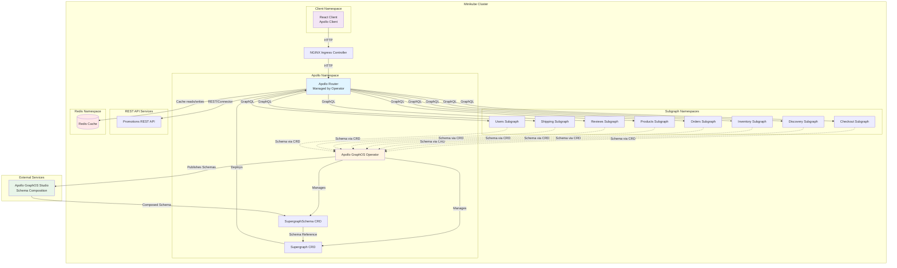
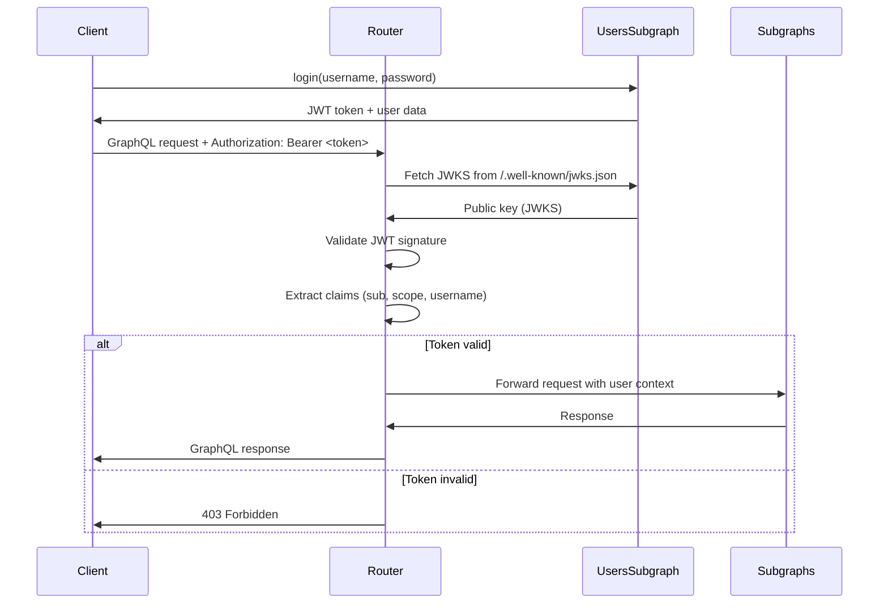

# Apollo Federation Supergraph Architecture

This repository contains a reference architecture utilizing [Kubernetes](https://kubernetes.io/docs/concepts/overview/) when using [Apollo Federation](https://www.apollographql.com/docs/federation/). It is designed to run locally on [Minikube](https://minikube.sigs.k8s.io/) for development and testing purposes.

Once the architecture is fully stood up, you'll have: 

- An Apollo Router running and managed by the [Apollo GraphOS Operator](https://www.apollographql.com/docs/apollo-operator/), utilizing:
  - [A coprocessor for handling customizations outside of the router](https://www.apollographql.com/docs/router/customizations/coprocessor)
  - [Authorization/Authentication directives](https://www.apollographql.com/docs/router/configuration/authorization)
- Eight subgraphs plus a connector-based promotions subgraph, each handling a portion of the overall supergraph schema, with schemas automatically published to GraphOS via the operator using inline SDL
- A promotions REST API (Node/Express) deployed as a data source for the [Apollo Connector](https://www.apollographql.com/docs/graphos/connectors/) that extends products with promotion data
- A React-based frontend application utilizing Apollo Client (optional)
- Apollo GraphOS Operator for automated schema publishing, composition, and deployment
- Step-by-step scripts for easy local setup and deployment

### The ending architecture


```mermaid
graph TB
    subgraph "Minikube Cluster"
        subgraph "Client Namespace"
            Client[React Client<br/>Apollo Client]
        end
        
        subgraph "Apollo Namespace"
            Router[Apollo Router<br/>Managed by Operator]
            Operator[Apollo GraphOS Operator]
            SupergraphSchema[SupergraphSchema CRD]
            Supergraph[Supergraph CRD]
        end
        
        subgraph "Subgraph Namespaces"
            Checkout[Checkout Subgraph]
            Discovery[Discovery Subgraph]
            Inventory[Inventory Subgraph]
            Orders[Orders Subgraph]
            Products[Products Subgraph]
            Reviews[Reviews Subgraph]
            Shipping[Shipping Subgraph]
            Users[Users Subgraph]
        end
        
        subgraph "REST API Services"
            PromotionsAPI[Promotions REST API]
        end
        

        subgraph "Redis Namespace"
            Redis[(Redis Cache)]
        end

        Ingress[NGINX Ingress Controller]
    end
    
    subgraph "External Services"
        GraphOS[Apollo GraphOS Studio<br/>Schema Composition]
    end
    
    Client -->|HTTP| Ingress
    Ingress -->|HTTP| Router
    Router -->|GraphQL| Checkout
    Router -->|GraphQL| Discovery
    Router -->|GraphQL| Inventory
    Router -->|GraphQL| Orders
    Router -->|GraphQL| Products
    Router -->|GraphQL| Reviews
    Router -->|GraphQL| Shipping
    Router -->|GraphQL| Users
    Router -->|REST/Connector| PromotionsAPI
    
    Router -->|Cache reads/writes| Redis

    Operator -->|Manages| SupergraphSchema
    Operator -->|Manages| Supergraph
    Operator -->|Publishes Schemas| GraphOS
    GraphOS -->|Composed Schema| SupergraphSchema
    SupergraphSchema -->|Schema Reference| Supergraph
    Supergraph -->|Deploys| Router
    
    Checkout -.->|Schema via CRD| Operator
    Discovery -.->|Schema via CRD| Operator
    Inventory -.->|Schema via CRD| Operator
    Orders -.->|Schema via CRD| Operator
    Products -.->|Schema via CRD| Operator
    Reviews -.->|Schema via CRD| Operator
    Shipping -.->|Schema via CRD| Operator
    Users -.->|Schema via CRD| Operator
    
    style Router fill:#e1f5ff
    style Operator fill:#fff4e1
    style GraphOS fill:#e8f5e9
    style Client fill:#f3e5f5
    style Redis fill:#ffe8e8
```


### Prerequisites

At a minimum, you will need:

- [Minikube](https://minikube.sigs.k8s.io/docs/start/) installed and configured
- [kubectl](https://kubernetes.io/docs/tasks/tools/) installed
- [Helm](https://helm.sh/docs/intro/install/) installed
- [Docker](https://docs.docker.com/get-docker/) installed
- [jq](https://stedolan.github.io/jq/download/) installed
- [curl](https://curl.se/) installed
- An [Apollo GraphOS account](https://studio.apollographql.com/signup) with a Personal API key
  - You can use [a free enterprise trial account](https://studio.apollographql.com/signup?type=enterprise-trial) if you don't have an enterprise contract.

Further requirements and detailed setup instructions are available in the [setup guide](./docs/setup.md).

## Contents

- ⏱ estimated time: 30 minutes
- 💰 estimated cost: $0 (runs locally on your machine)

### [Setup](/docs/setup.md)

During setup, you'll be:

- Installing and configuring Minikube
- Creating an Apollo GraphOS graph and variants
- Setting up the Kubernetes cluster and Apollo GraphOS Operator
- Building Docker images locally
- Deploying subgraphs, router, and client using step-by-step scripts

### [Operator Guide](/docs/operator-guide.md)

Learn how the Apollo GraphOS Operator works in this architecture, including:
- Schema publishing and composition flow
- Monitoring operator-managed resources
- Troubleshooting common issues
- Updating router configuration

### [Authorization Guide](/docs/authorization.md)

Learn about the authorization implementation, including:
- Scope naming conventions and usage
- Authorization directive patterns (`@authenticated`, `@requiresScopes`)
- Resource-level authorization patterns
- Testing authorization scenarios

### [Response Caching Guide](/docs/response-caching-guide.md)

Learn about response caching in this architecture, including:
- How the router caches subgraph responses in Redis
- Schema-level cache control with `@cacheControl` directives
- Dev vs. production caching configuration
- Verifying cache behavior using Apollo Sandbox

### [Cleanup](/docs/cleanup.md)

Once finished, you can cleanup your environments following the above document.

## Authentication & Authorization

### Authentication Flow

This architecture implements JWT-based authentication using self-hosted keys and the Apollo Router's built-in JWT authentication plugin.

#### JWT Generation

When a user logs in via the `login` mutation in the users subgraph:

1. **Token Creation**: A JWT is generated using ES256 (ECDSA with P-256) algorithm
2. **Signing Key**: The token is signed with a private key stored at `./keys/private_key.pem`
3. **Token Claims**: The JWT includes:
   - `sub`: User ID
   - `scope`: Space-separated list of authorization scopes
   - `username`: User's username
4. **Expiration**: Tokens expire after 2 hours

#### JWKS Endpoint

The users subgraph serves a JSON Web Key Set (JWKS) endpoint at `/.well-known/jwks.json` that exposes the public key corresponding to the private key used for signing. This endpoint is used by the router to validate incoming JWT tokens.

#### Router-Level Validation

The Apollo Router is configured to validate JWT tokens before processing requests:

```yaml
authentication:
  router:
    jwt:
      jwks:
        - url: http://graphql.users.svc.cluster.local:4001/.well-known/jwks.json
```

The router:
- Extracts the JWT from the `Authorization: Bearer <token>` header
- Validates the token signature using the JWKS endpoint
- Extracts claims and adds them to the request context
- Enforces the `@authenticated` directive at the router level

#### Request Flow


```mermaid
sequenceDiagram
    participant Client
    participant Router
    participant UsersSubgraph
    participant Subgraphs

    Client->>UsersSubgraph: login(username, password)
    UsersSubgraph->>Client: JWT token + user data
    
    Client->>Router: GraphQL request + Authorization: Bearer <token>
    Router->>UsersSubgraph: Fetch JWKS from /.well-known/jwks.json
    UsersSubgraph->>Router: Public key (JWKS)
    Router->>Router: Validate JWT signature
    Router->>Router: Extract claims (sub, scope, username)
    
    alt Token valid
        Router->>Subgraphs: Forward request with user context
        Subgraphs->>Router: Response
        Router->>Client: GraphQL response
    else Token invalid
        Router->>Client: 403 Forbidden
    end
```

### Current Authorization State

The architecture uses Apollo Router's authorization directives to control access:

#### `@authenticated` Directive

Requires a valid JWT token to access a field or type. Currently used on:
- `me: User @authenticated` - Query to get current user's information

#### `@requiresScopes` Directive

Requires specific scopes in the JWT token to access a field. Currently used on:
- `email: String @requiresScopes(scopes: [["user:read:email"]])` - Requires `user:read:email` scope to read user email

#### Manual Scope Checking

Some resolvers perform manual scope validation:
- The `user` query checks if the requester has `user:read:email` scope before returning email addresses for other users

For detailed authorization patterns and implementation guide, see [Authorization Guide](/docs/authorization.md).
