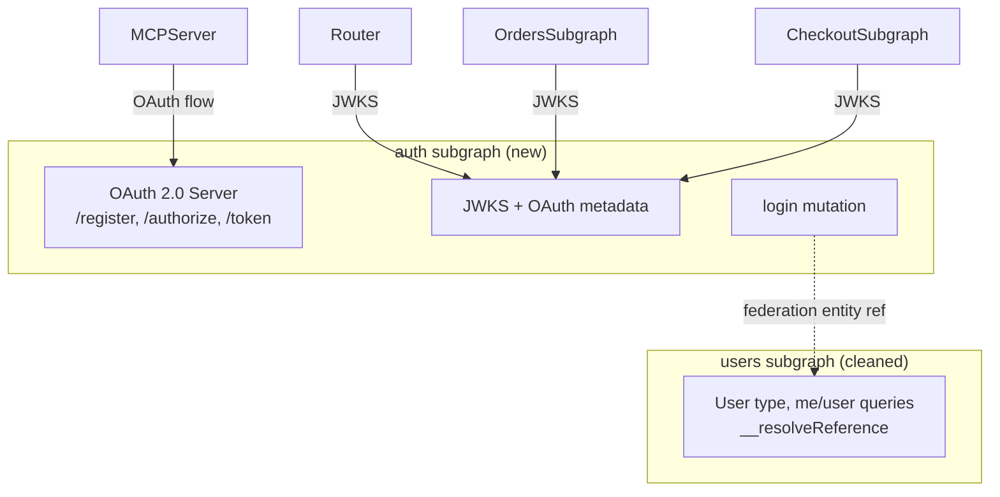

# TODO: Split Auth Service from Users Subgraph

## Problem

The users subgraph (`subgraphs/users/`) currently serves three distinct roles: user data, identity/login, and OAuth 2.0 authorization server. The `index.ts` is 287 lines, ~60% auth infrastructure. In-memory OAuth state forces `replicaCount: 1`.

## Architecture After Split

The auth subgraph participates in the supergraph (contributes `login` mutation, `LoginResponse` types) so the client app needs zero changes. It references `User` via `@key(fields: "id", resolvable: false)` -- the users subgraph resolves the full entity.

## Tasks

### 1. Create the auth subgraph (`subgraphs/auth/`)

- [ ] Create `subgraphs/auth/` with `schema.graphql` (login mutation, LoginResponse types, User entity stub), `src/index.ts` (Express with all OAuth routes moved from users, login mutation resolver, JWKS endpoint, renderLoginPage), `keys/` (copy from users), `package.json`, `tsconfig.json`, `Dockerfile`, `deploy/` Helm chart (port 4011, replicaCount 1)
- [ ] Create `subgraphs/auth/src/credentials.ts` with minimal user credential data (id, username, scopes only) for login validation -- keeps domain boundary clean vs importing full user profile data

### 2. Clean up the users subgraph

- [ ] Clean `subgraphs/users/src/index.ts`: remove all OAuth routes, renderLoginPage, getIssuer, OAuthParams, in-memory OAuth stores, crypto/readFile/createPrivateKey imports, users data import. Revert from Express to `startStandaloneServer`. Keep JWT verification in context middleware (same keys work)
- [ ] Clean `subgraphs/users/src/resolvers/index.ts`: remove login mutation resolver, LoginResponse type resolver, jose/readFile/createPrivateKey imports. Keep `Query.user`, `Query.me`, `User.__resolveReference`
- [ ] Clean `subgraphs/users/schema.graphql`: remove Mutation type (login), LoginResponse union, LoginSuccessful, LoginFailed types
- [ ] Set users subgraph back to `replicaCount: 3` in `values.yaml` since it no longer holds in-memory OAuth state

### 3. Update JWKS and auth references

- [ ] Update JWKS URL from `graphql.users.svc.cluster.local:4001` to `graphql.auth.svc.cluster.local:4011` in: `deploy/operator-resources/supergraph-dev.yaml`, `deploy/operator-resources/supergraph-prod.yaml`, `subgraphs/orders/src/index.ts`, `subgraphs/checkout/src/index.ts`
- [ ] Update `deploy/apollo-mcp-server/mcp.yaml` `auth.servers` and `scripts/minikube/12-deploy-mcp-server.sh` to reference auth service instead of users

### 4. Update deployment scripts

- [ ] Add `auth` to SUBGRAPHS array in `scripts/minikube/05-deploy-subgraphs.sh` and image build list in `scripts/minikube/04-build-images.sh`

### 5. Update documentation

- [ ] Update `docs/setup.md` (port-forward auth:4011 instead of users:4001, `/etc/hosts` entry), `docs/mcp-production.md`, `README.md` references

## Key Files Reference

| File | Change |
|------|--------|
| `subgraphs/users/src/index.ts` | Remove OAuth routes, revert to `startStandaloneServer` |
| `subgraphs/users/src/resolvers/index.ts` | Remove `login` mutation, `LoginResponse` |
| `subgraphs/users/schema.graphql` | Remove `login`, `LoginResponse`, `LoginSuccessful`, `LoginFailed` |
| `deploy/operator-resources/supergraph-dev.yaml` | Change JWKS URL to auth service |
| `deploy/operator-resources/supergraph-prod.yaml` | Change JWKS URL to auth service |
| `deploy/apollo-mcp-server/mcp.yaml` | Change `auth.servers` to auth service |
| `subgraphs/orders/src/index.ts` | Update `JWKS_URL` |
| `subgraphs/checkout/src/index.ts` | Update `JWKS_URL` |
| `scripts/minikube/04-build-images.sh` | Add `auth` to build list |
| `scripts/minikube/05-deploy-subgraphs.sh` | Add `auth` to SUBGRAPHS array |
| `scripts/minikube/12-deploy-mcp-server.sh` | Update port-forward instructions |
| `docs/setup.md` | Update `/etc/hosts` and port-forward instructions |
| `docs/mcp-production.md` | Update references |
