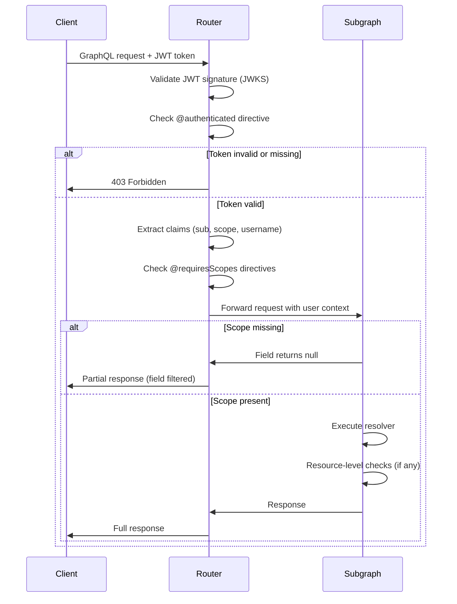

# Authorization Guide

This guide explains how authorization is implemented in this reference architecture using Apollo Router's authorization directives and scope-based access control.

## Overview

Authorization in this architecture uses a combination of:
- **Router-level directives**: `@authenticated` and `@requiresScopes` enforced by the Apollo Router
- **Resource-level authorization**: Ownership checks in resolvers
- **Scope-based access control**: Fine-grained permissions via JWT scopes

## Scope Naming Convention

Scopes follow a hierarchical naming pattern: `<resource>:<action>:<detail>`

### Scope Format

- **Resource**: The entity being accessed (e.g., `user`, `order`, `cart`)
- **Action**: The operation being performed (e.g., `read`, `write`, `delete`)
- **Detail** (optional): Specific field or sub-resource (e.g., `email`, `payment`)

### Standard Scopes

| Scope | Description | Example Usage |
|-------|-------------|---------------|
| `user:read:email` | Read user email addresses | Accessing another user's email field |
| `order:read` | Read order information | Querying orders (with ownership checks) |
| `order:write` | Create or modify orders | Creating orders during checkout |
| `cart:write` | Modify cart contents | Adding/removing items from cart |
| `admin:*` | Administrative access | Future: Admin-only operations |

### Adding New Scopes

When adding new scopes:
1. Follow the `<resource>:<action>:<detail>` pattern
2. Document the scope in this guide
3. Update the login mutation to accept the scope
4. Add `@requiresScopes` directive to protected fields

## Authorization Directives

### `@authenticated`

Requires a valid JWT token to access a field or type. The router validates the token before the request reaches subgraphs.

**Usage:**
```graphql
type Query {
  me: User @authenticated
}

type Mutation {
  cart: CartMutations @authenticated
}
```

**Behavior:**
- Router validates JWT signature using JWKS
- If token is invalid or missing, request is rejected with 403 Forbidden
- Valid tokens proceed with user claims in context

### `@requiresScopes`

Requires specific scopes in the JWT token to access a field. Scopes are space-separated in the JWT `scope` claim.

**Usage:**
```graphql
type User {
  email: String @requiresScopes(scopes: [["user:read:email"]])
}
```

**Scope Format:**
- `scopes: [["scope1", "scope2"]]` - Requires ALL listed scopes (AND logic)
- `scopes: [["scope1"], ["scope2"]]` - Requires ANY of the scope groups (OR logic)

**Example:**
```graphql
# Requires both scope1 AND scope2
field: String @requiresScopes(scopes: [["scope1", "scope2"]])

# Requires scope1 OR scope2
field: String @requiresScopes(scopes: [["scope1"], ["scope2"]])
```

## Authorization Patterns

### Pattern 1: Field-Level Protection

Protect sensitive fields with `@requiresScopes`:

```graphql
type User {
  id: ID!
  username: String!
  email: String @requiresScopes(scopes: [["user:read:email"]])
}
```

**Implementation:**
- Router checks JWT `scope` claim before field resolution
- If scope is missing, field returns `null` (or error if `reject_unauthorized: true`)

### Pattern 2: Operation-Level Protection

Protect entire operations with `@authenticated`:

```graphql
type Mutation {
  cart: CartMutations @authenticated
}

type CartMutations {
  checkout(paymentMethodId: ID!): CheckoutResult
  addVariantToCart(variantId: ID!, quantity: Int = 1): ResultWithMessage
}
```

**Implementation:**
- All cart mutations require authentication
- Router validates token before request reaches subgraph
- Resolvers can access `user` from context

### Pattern 3: Resource-Level Authorization

Enforce ownership checks in resolvers:

```typescript
Query: {
  order(_, { id }, { user }) {
    const order = getOrderById(id);
    
    if (!order) {
      throw new GraphQLError("Order not found");
    }

    // Resource-level authorization: users can only access their own orders
    if (user && user.sub) {
      const userId = user.sub as string;
      if (order.buyer.id !== userId) {
        throw new GraphQLError("Access denied: You can only view your own orders", {
          extensions: {
            code: "FORBIDDEN",
            http: { status: 403 },
          },
        });
      }
    }

    return order;
  },
}
```

**Implementation:**
- Use `@authenticated` to ensure user context is available
- Compare `user.sub` (from JWT) with resource owner
- Throw `FORBIDDEN` error if ownership check fails

### Pattern 4: Conditional Field Access

Combine manual checks with directives for complex logic:

```typescript
Query: {
  user(_, { id }, { user: payload }) {
    const user = getUserById(id);
    const userScopes = payload?.scope.split(' ') ?? []

    // Users can always see their own email
    // Others need user:read:email scope
    if (payload && payload.sub !== user.id && !userScopes.includes('user:read:email')) {
      delete user.email
    }

    return user;
  },
}
```

**Implementation:**
- Field has `@requiresScopes` for basic protection
- Resolver adds additional logic for self-access
- Manual scope check for cross-user access

## Request Flow with Authorization



## JWT Claims Structure

The JWT token contains the following claims:

```json
{
  "sub": "user:1",
  "scope": "user:read:email order:read cart:write",
  "username": "alice",
  "iat": 1234567890,
  "exp": 1234574490
}
```

- **`sub`**: User ID (subject)
- **`scope`**: Space-separated list of authorization scopes
- **`username`**: User's username
- **`iat`**: Issued at timestamp
- **`exp`**: Expiration timestamp (2 hours from issue)

## Testing Authorization

### Testing Authentication

```bash
# Without token - should fail
curl -X POST http://localhost:4000/graphql \
  -H "Content-Type: application/json" \
  -d '{"query": "query { me { id username } }"}'

# With valid token - should succeed
curl -X POST http://localhost:4000/graphql \
  -H "Content-Type: application/json" \
  -H "Authorization: Bearer <token>" \
  -d '{"query": "query { me { id username } }"}'
```

### Testing Scope-Based Authorization

```bash
# Login without user:read:email scope
mutation {
  login(username: "alice", password: "password", scopes: []) {
    ... on LoginSuccessful {
      token
    }
  }
}

# Query user email without scope - should return null
query {
  user(id: "user:1") {
    id
    email  # Returns null without user:read:email scope
  }
}

# Login with user:read:email scope
mutation {
  login(username: "alice", password: "password", scopes: ["user:read:email"]) {
    ... on LoginSuccessful {
      token
    }
  }
}

# Query user email with scope - should return email
query {
  user(id: "user:1") {
    id
    email  # Returns email with user:read:email scope
  }
}
```

### Testing Resource-Level Authorization

```bash
# Login as user:1
mutation {
  login(username: "alice", password: "password", scopes: []) {
    ... on LoginSuccessful {
      token
    }
  }
}

# Query own order - should succeed
query {
  order(id: "order:1") {  # Assuming order:1 belongs to user:1
    id
    buyer { id }
  }
}

# Query another user's order - should fail with FORBIDDEN
query {
  order(id: "order:3") {  # Assuming order:3 belongs to user:2
    id
    buyer { id }
  }
}
```

## Router Configuration

Authorization is enabled in the router configuration:

```yaml
authentication:
  router:
    jwt:
      jwks:
        - url: http://graphql.users.svc.cluster.local:4001/.well-known/jwks.json

authorization:
  directives:
    enabled: true
    reject_unauthorized: false  # Set to true to reject entire query if any field is filtered
    errors:
      log: true
      response: "errors"  # Include authorization errors in response
```

### Configuration Options

- **`reject_unauthorized`**: If `true`, rejects entire query if any field would be filtered. If `false`, returns partial results.
- **`errors.log`**: Log authorization errors to router logs
- **`errors.response`**: Include authorization errors in GraphQL response (`"errors"`, `"extensions"`, or `"none"`)

## Best Practices

1. **Use `@authenticated` for operations**: Protect mutations and sensitive queries at the operation level
2. **Use `@requiresScopes` for fields**: Protect individual fields that require specific permissions
3. **Combine with resource checks**: Use resolver-level checks for ownership validation
4. **Document scopes**: Maintain a clear scope naming convention and document all scopes
5. **Test authorization**: Include authorization tests in your test suite
6. **Error handling**: Provide clear error messages for authorization failures
7. **Scope minimization**: Only request scopes that are actually needed

## Common Patterns

### Self-Access Pattern

Users can always access their own resources without special scopes:

```typescript
if (user && user.sub === resource.ownerId) {
  // Allow access
} else if (userScopes.includes('resource:read')) {
  // Allow access with scope
} else {
  // Deny access
}
```

### Admin Override Pattern

Admins can access any resource:

```typescript
const isAdmin = userScopes.some(scope => scope.startsWith('admin:'));
if (isAdmin) {
  // Allow access
} else {
  // Check ownership or scopes
}
```

### Scope Hierarchy Pattern

Support scope hierarchies (e.g., `admin:*` grants all permissions):

```typescript
const hasPermission = (requiredScope: string, userScopes: string[]) => {
  return userScopes.some(scope => 
    scope === requiredScope || 
    scope === 'admin:*' ||
    (scope.endsWith(':*') && requiredScope.startsWith(scope.slice(0, -2)))
  );
};
```

## Troubleshooting

### Issue: Fields returning null unexpectedly

**Cause**: Missing required scope or `@requiresScopes` directive not working

**Solution**:
1. Check JWT token includes required scope in `scope` claim
2. Verify `@requiresScopes` directive syntax
3. Check router logs for authorization errors
4. Verify `authorization.directives.enabled: true` in router config

### Issue: 403 Forbidden on authenticated requests

**Cause**: Invalid or expired JWT token

**Solution**:
1. Verify token is not expired
2. Check JWKS endpoint is accessible
3. Verify token signature is valid
4. Check router can fetch JWKS from configured URL

### Issue: Resource-level checks not working

**Cause**: User context not extracted in subgraph

**Solution**:
1. Verify subgraph context function extracts JWT claims
2. Check `user.sub` is available in resolver context
3. Ensure JWT validation happens in subgraph context function

## Further Reading

- [Apollo Router Authorization Documentation](https://www.apollographql.com/docs/router/configuration/authorization)
- [JWT Authentication in Apollo Router](https://www.apollographql.com/docs/graphos/routing/security/jwt)
- [Authorization Directives Reference](https://www.apollographql.com/docs/router/configuration/authorization#directives)
