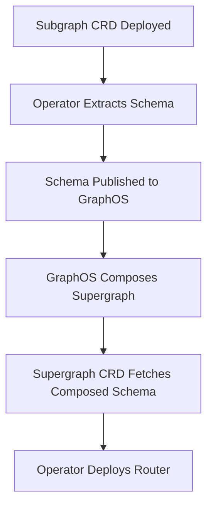

# Apollo GraphOS Operator Guide

This document explains how the Apollo GraphOS Operator is used in this reference architecture.

## Overview

The Apollo GraphOS Operator automates the management of GraphQL subgraphs and supergraphs in Kubernetes. It handles:
- Schema publishing to Apollo GraphOS
- Automatic composition of subgraphs into a supergraph
- Deployment of the Apollo Router
- Schema change detection and re-composition

## How It Works

### Architecture Components

The operator manages three types of Kubernetes resources:

1. **Subgraph** - Defines a GraphQL subgraph with its schema location and endpoint
2. **SupergraphSchema** - Selects Subgraphs and composes them into a supergraph schema
3. **Supergraph** - Deploys the composed schema as a running Apollo Router

### Schema Publishing Flow



When a Subgraph CRD is deployed:
1. The operator extracts the schema from the container image (`/app/schema.graphql`)
2. Publishes the schema to Apollo GraphOS Studio
3. SupergraphSchema triggers composition of all matching subgraphs
4. The composed schema is available in GraphOS Studio
5. The Supergraph CRD fetches the composed schema and deploys the router

## Namespace Organization

### Dev Environment (`apollo-supergraph-k8s-dev` cluster)

- **apollo-operator**: Operator installation and controller
- **apollo**: SupergraphSchema and Supergraph resources, router deployment
- **checkout, discovery, inventory, orders, products, reviews, shipping, users**: Individual subgraph services

### Prod Environment (`apollo-supergraph-k8s-prod` cluster)

Same structure as dev, but with production configurations (more replicas, telemetry, persisted queries).

## Label Strategy

### Subgraph Labels

Each Subgraph CRD has two labels:

- `app: {subgraph-name}` - Unique identifier for each subgraph
- `apollo.io/subgraph: "true"` - Common label used for composition selection

### SupergraphSchema Selection

The SupergraphSchema uses `matchExpressions` to select all subgraphs:

```yaml
spec:
  selectors:
    - matchExpressions:
        - key: apollo.io/subgraph
          operator: Exists
```

This matches any Subgraph CRD with the `apollo.io/subgraph` label, regardless of value.

## Monitoring Resources

### Check Subgraph Status

```bash
# List all subgraphs
kubectl get subgraph --all-namespaces

# Describe a specific subgraph
kubectl describe subgraph checkout -n checkout

# Watch subgraph status
kubectl get subgraph -w
```

Look for `SchemaLoaded` condition in the status to verify schema extraction.

### Check Composition Status

```bash
# Get SupergraphSchema status
kubectl get supergraphschema -n apollo

# Describe for detailed status
kubectl describe supergraphschema reference-architecture-dev -n apollo
```

Status conditions:
- **SubgraphsDetected**: Lists all matching subgraphs and their schema hashes
- **CompositionPending**: Shows composition request state
- **Available**: Indicates successful composition with launch ID

### Check Router Deployment

```bash
# Get supergraph status
kubectl get supergraph -n apollo

# Describe for detailed status
kubectl describe supergraph reference-architecture-dev -n apollo
```

Status conditions:
- **SchemaLoaded**: Latest supergraph schema loaded
- **Progressing**: Deployment in progress
- **Ready**: Router replicas are running and ready

## Automatic Schema Changes

When you update a subgraph schema and redeploy the image:

1. Build and push new image with updated schema
2. Update the Subgraph CRD to reference the new image
3. Operator detects the change and extracts the new schema
4. Schema is published to GraphOS Studio
5. SupergraphSchema triggers re-composition
6. Supergraph fetches the new composed schema
7. Router is rolled out with the new schema

### Manual Trigger

If you need to manually trigger composition:

```bash
# Edit the SupergraphSchema
kubectl edit supergraphschema reference-architecture-dev -n apollo

# Temporarily disable composition
# Set: compositionEnabled: false

# Save and exit, then re-enable
# Set: compositionEnabled: true (or remove the field)
```

## Troubleshooting

### Subgraph Not Publishing

**Symptoms**: Schema doesn't appear in GraphOS Studio

**Check**:
```bash
kubectl describe subgraph <name> -n <namespace>
```

Look for errors in:
- Schema extraction from image
- API key authentication
- Network connectivity to GraphOS

### Composition Failing

**Symptoms**: No composed schema available

**Check**:
```bash
kubectl describe supergraphschema <name> -n apollo
```

Common issues:
- Schema conflicts between subgraphs
- Invalid graph ID or variant
- Missing subgraphs (if not using `partial: true`)

### Router Not Deploying

**Symptoms**: No router pods running

**Check**:
```bash
kubectl describe supergraph <name> -n apollo
```

Look for:
- Schema loading errors
- Image pull errors
- Resource constraints
- Pod scheduling issues

### Viewing Router Logs

```bash
# Get router pods
kubectl get pods -n apollo

# View logs
kubectl logs -n apollo deployment/reference-architecture-{dev|prod}
```

## Updating Router Configuration

To update router configuration without changing subgraphs:

```bash
# Edit the Supergraph CRD
kubectl edit supergraph reference-architecture-dev -n apollo

# Update spec.podTemplate.router.configuration
# Save and the operator will roll out the changes
```

Changes are applied via rolling update - the operator manages the rollout.

## Best Practices

1. **Version Schemas**: Keep track of schema versions in your container images
2. **Monitor Compositions**: Set up alerts on composition failures
3. **Test Locally**: Use local development with the operator before promoting to prod
4. **Gradual Rollout**: Update schemas incrementally and monitor composition
5. **Backup Configs**: Keep Supergraph and SupergraphSchema YAML files in version control

## Additional Resources

- [Apollo GraphOS Operator Documentation](https://www.apollographql.com/docs/apollo-operator)
- [Operator API Reference](https://www.apollographql.com/docs/apollo-operator/resources)
- [GraphOS Studio](https://studio.apollographql.com)

