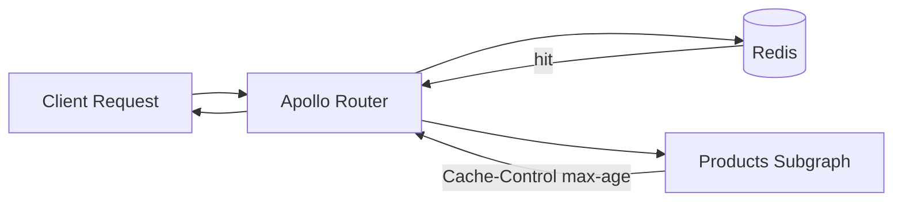
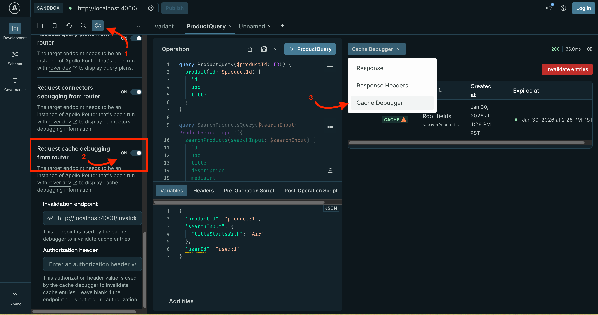
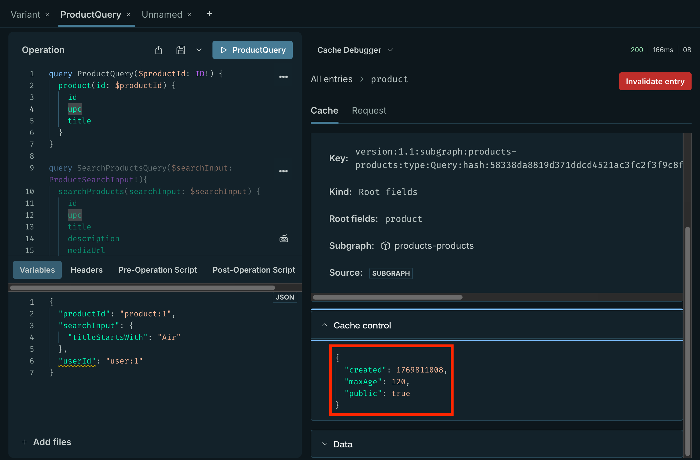
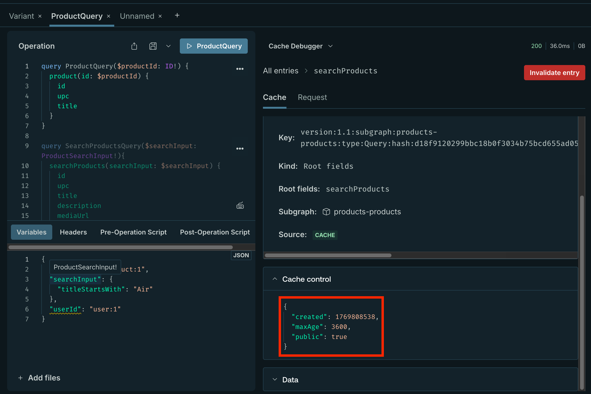

# Response Caching Guide

This document explains how response caching is used in this reference architecture.

## Overview

The Apollo Router can cache subgraph responses in Redis to improve query latency. Response caching in this reference architecture:

- Requires Router v2.10.0 or later
- Uses a Redis instance deployed via [scripts/minikube/07-deploy-redis.sh](scripts/minikube/07-deploy-redis.sh)
- Is configured in the Supergraph CRD under `spec.routerConfig.response_cache`

The router uses cache semantics from subgraph responses (for example by setting the `Cache-Control` header directly or using the `@cacheControl` directive in the schema) to decide what to cache and for how long. A fallback TTL is required so the router can start even when responses do not include cache headers.

## How It Works

### Cache Flow



When a request hits the router:

1. The router checks the cache (Redis) for a matching entry.
2. On a cache hit, the router returns the cached response and does not call the subgraph.
3. On a cache miss, the router calls the subgraph, receives the response (including cache semantics), and may store it in Redis for subsequent requests.

### What Is Cached in This Reference Architecture

Only subgraphs that define cache semantics contribute to response caching. In this repo, the **products** subgraph is configured for caching.

#### Schema: Cache Control Directive and Scope

The products schema defines the `@cacheControl` directive and `CacheControlScope` enum in [subgraphs/products/schema.graphql](subgraphs/products/schema.graphql) (lines 7–21):

```graphql
"""
The scope of the cache control directive
PUBLIC (default): The data is identical for all users and can be shared in the cache
PRIVATE: The data is user-specific and requires a private_id configuration to cache per-user
"""
enum CacheControlScope {
  PUBLIC
  PRIVATE
}

directive @cacheControl(
  maxAge: Int
  scope: CacheControlScope
  inheritMaxAge: Boolean
) on FIELD_DEFINITION | OBJECT | INTERFACE | UNION
```

#### Schema: Root Field

The `product` query field (lines 34–37) has a root-level cache hint:

```graphql
product(id: ID!): Product @cacheControl(maxAge: 120)
```

This annotation allows the response for the single-product query to be cached for 120 seconds.

#### Schema: Product Type

The `Product` type (line 68) is marked cacheable with a longer TTL and PUBLIC scope:

```graphql
type Product @key(fields: "id") @key(fields: "upc") @tag(name: "partner") @cacheControl(maxAge: 3600, scope: PUBLIC) {
  # ...
}
```

#### Effective Behavior

For an operation that queries using the top-level `product` query, the cacheable TTL is the minimum along the path: **120 seconds** from the root field. The Product data is **PUBLIC**, so it can be shared in the cache for all users. Other subgraphs in this repo (inventory, users, etc.) do not define `@cacheControl` in their schemas, so their responses are not cached by the router in this setup.

## Router Configuration

Response caching is configured in the Supergraph CRD under `spec.routerConfig.response_cache`.

### Required Settings

- **enabled**: Set to `true` to enable response caching.
- **ttl**: A fallback TTL (for example `5m`) is required so the router can start when subgraph responses do not include `Cache-Control` headers. This TTL applies to all subgraphs and can be overridden per subgraph.
- **redis.urls**: One or more Redis URLs. In this architecture, the router uses the Redis instance installed by the Redis Helm chart: `redis://redis-master.redis.svc.cluster.local:6379`.

### Optional Settings

- **debug**: When `true`, the router exposes cache debug information (for example in Apollo Sandbox/Explorer), such as whether a response came from cache or subgraph. Enable only in development; see Dev vs prod configuration below.

Example block (from [deploy/operator-resources/supergraph-dev.yaml](deploy/operator-resources/supergraph-dev.yaml)):

```yaml
response_cache:
  enabled: true
  debug: true
  subgraph:
    all:
      enabled: true
      ttl: 5m
      redis:
        urls: ["redis://redis-master.redis.svc.cluster.local:6379"]
```

## Dev vs Prod Configuration

| Option | Dev | Prod |
|--------|-----|------|
| `response_cache.enabled` | true | true |
| `response_cache.debug` | true | not set |
| `subgraph.all.enabled` | true | true |
| `subgraph.all.ttl` | 5m | 5m |
| Redis URL | redis-master.redis.svc.cluster.local:6379 | same |

**Dev** ([deploy/operator-resources/supergraph-dev.yaml](deploy/operator-resources/supergraph-dev.yaml) lines 27–35): Includes `debug: true` so you can use the cache debugger in Apollo Sandbox or Explorer to see cache hits and response source.

**Prod** ([deploy/operator-resources/supergraph-prod.yaml](deploy/operator-resources/supergraph-prod.yaml) lines 27–34): Same `enabled`, `subgraph.all`, `ttl`, and Redis URL, but **no** `debug`. Omit `debug` in production to avoid exposing cache debug information.

## Verifying Cache Behavior

### Using Apollo Sandbox or Explorer (Cache Debugger)

When the router is configured with `response_cache.debug: true` (dev), you can see cache behavior in the response:

1. Open Apollo Sandbox or Explorer and point it at your router (for example `http://localhost:4000` if using port-forward).
2. Enable the cache debugger in the UI



3. Run a query that hits the products subgraph, for example: `query { product(id: "product:1") { id upc title } }`.
4. Run the same query again. Inspect the response or debug panel for cache details. The screenshot below shows cache details including the longer maxAge for the top level product query.



5. Next run a query that returns the Product type twice and review the cache details, for example:
``` graphql
query SearchProductsQuery($searchInput: ProductSearchInput!){
  searchProducts(searchInput: $searchInput) {
    id
    upc
    title
    description
    mediaUrl
    releaseDate
  }
}

# variables
{
  "searchInput": {
    "titleStartsWith": "Air"
  },
}
```



6. Note the longer `maxAge` since the `Product` type is defined with the longer maxAge than that root product query: `type Product ... @cacheControl(maxAge: 3600, scope: PUBLIC)`

## Updating Router Configuration

To change response caching settings:

1. Edit `deploy/operator-resources/supergraph-${ENVIRONMENT}.yaml`.
2. Update the `spec.routerConfig.response_cache` section.
3. Apply: `./scripts/minikube/08-deploy-operator-resources.sh`
4. The operator updates the router deployment and rolls out the change.

## Troubleshooting

### Cache Not Used (Responses Always From Subgraph)

**Symptoms**: Repeated identical queries always hit the subgraph; cache debugger shows `source: subgraph` every time.

**Check**:

- Verify the products subgraph returns cache semantics (subgraph server must send `Cache-Control` or use schema `@cacheControl` with a plugin that sets headers). See [subgraphs/products/schema.graphql](subgraphs/products/schema.graphql) and the products subgraph server setup.
- Confirm Redis is running: `kubectl get pods -n redis`, `kubectl get svc -n redis`.
- Confirm router config: `kubectl get supergraph reference-architecture-${ENVIRONMENT} -n apollo -o yaml | grep -A 15 response_cache`.
- Look for cache-related errors in router logs: `kubectl logs -n apollo deployment/reference-architecture-${ENVIRONMENT}`.

### Router Fails to Start or Rejects Config

**Symptoms**: Router pods not ready or router reports invalid config.

**Check**:

- Ensure `response_cache.subgraph.all.ttl` is set (required when response caching is enabled).
- Ensure `response_cache.subgraph.all.redis.urls` is set and Redis is reachable from the router (same cluster: `redis-master.redis.svc.cluster.local:6379`).
- See [docs/debugging.md](docs/debugging.md) for Redis and response caching verification steps.

## Additional Resources

- [Response Caching Quickstart](https://www.apollographql.com/docs/graphos/routing/performance/caching/response-caching/quickstart)
- [Response Cache Customization](https://www.apollographql.com/docs/graphos/routing/performance/caching/response-caching/customization) (private data, cache keys, Redis options)
- [Debugging: Response caching (Redis)](docs/debugging.md#response-caching-redis) for operational checks (Redis pods, router config, cache metrics)
- [Setup: Script 07 Deploy Redis](docs/setup.md) for deploying Redis in this reference architecture

## Improvements
- [ ] Add cache control details to another entity to show how full responses are cached vs entities
- [ ] Configure @cacheTag and provide an example of active invalidation
- [ ] Provide an example of PRIVATE cache control configuration
- [ ] Confirm cache telemetry in Grafana
